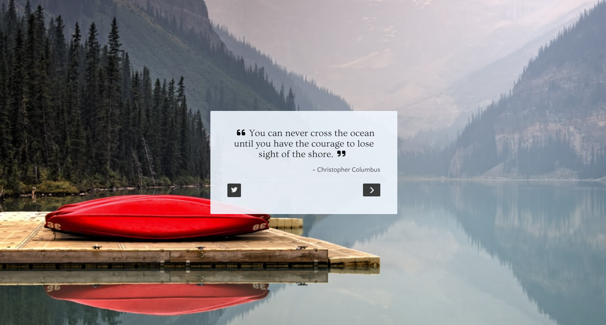
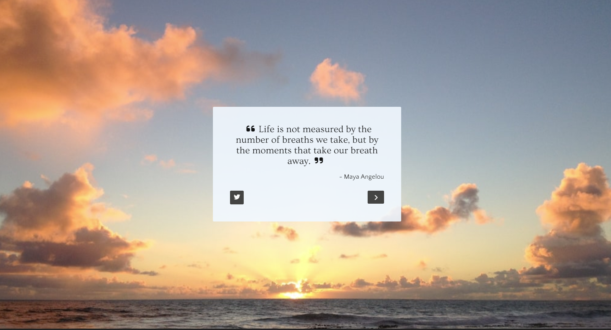

# Random Quote Machine ❝ ❞

## Description 

A React app that retrieves random quotes from an API. Users can generate new quotes and share their favorite quotes on Twitter. 

A FreeCodeCamp Front End Development Libraries project, with the objective to fulfill the user stories and get all of the tests to pass. 

## Built With

## Snapshot 

## Link
[Random Quote Machine](https://react-app-random-quotes.netlify.app)

## User Stories

~~~~~~~
User Story #1: I can see a wrapper element with a corresponding id="quote-box".

User Story #2: Within #quote-box, I can see an element with a corresponding id="text".

User Story #3: Within #quote-box, I can see an element with a corresponding id="author".

User Story #4: Within #quote-box, I can see a clickable element with a corresponding id="new-quote".

User Story #5: Within #quote-box, I can see a clickable a element with a corresponding id="tweet-quote".

User Story #6: On first load, my quote machine displays a random quote in the element with id="text".

User Story #7: On first load, my quote machine displays the random quote's author in the element with id="author".

User Story #8: When the #new-quote button is clicked, my quote machine should fetch a new quote and display it in the #text element.

User Story #9: My quote machine should fetch the new quote's author when the #new-quote button is clicked and display it in the #author element.

User Story #10: I can tweet the current quote by clicking on the #tweet-quote a element. This a element should include the "twitter.com/intent/tweet" path in its href attribute to tweet the current quote.

User Story #11: The #quote-box wrapper element should be horizontally centered. Please run tests with browser's zoom level at 100% and page maximized.
~~~~~~~

## Credits
Images from: 
[Uplash](https://www.uplash.com)

Speech bubble favicon from:
[flaticon](https://www.flaticon.com/free-icon/quotation-marks-in-speech-bubble_1294?term=quotes&page=1&position=41&page=1&position=41&related_id=1294&origin=tag)

## License
Licensed under the MIT license.

## Questions 
[Email Me](Chloe.a.harris17@gmail.com) if you have any questions.

Check out more of my work on [GitHub](https://github.com/chloeharris1).